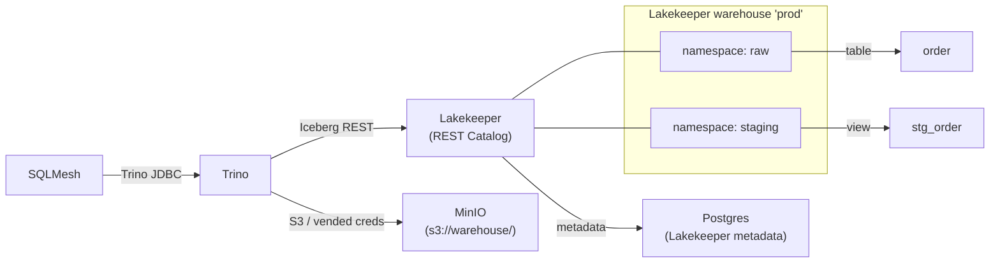

# Iceberg Analytics Engineering Template

Apache Iceberg analytics stack for analytics engineer take-home tests. Trino + Iceberg + Lakekeeper + MinIO + SQLMesh, with UV for Python dependency management.

## Air Service take-home

This branch contains the complete Air Service analytical model. See:

- [Analytical design, ERD, model dictionary, KPIs, and limitations](docs/air-service-analytics.md)
- [Source provenance, conversion fidelity, and dataset profile](docs/data-provenance.md)

Run `just verify-orb` for a clean native full-stack load, plan, execution, audit/test, query, and teardown. Run `just load-raw` when services are already up.

## Tech Stack

| Component | Version | Purpose |
|-----------|---------|---------|
| Trino | 476 | SQL query engine |
| Apache Iceberg | — | Table format |
| Lakekeeper | v0.12.4 | Iceberg REST Catalog |
| MinIO | RELEASE.2025-07-23 | S3-compatible object storage |
| SQLMesh | latest | Transformations framework + built-in linter |
| UV | — | Python dependency management |
| just | — | CLI command runner |

## Quick Start

### Docker (local development)

```bash
cp .env.example .env
just setup        # install Python deps
just infra-up     # start Trino, Lakekeeper, MinIO, Postgres (Docker)
just load-raw     # load data/*.csv into prod.raw outside SQLMesh
just plan-auto    # apply SQLMesh plan
just run          # run models
just test         # run tests
```

### Orb-native (Amp cloud sandbox — no Docker)

```bash
just orb-setup    # install JDK 24, Trino, MinIO, Lakekeeper, PostgreSQL
just orb-up       # start all services as native processes
just load-raw     # load data/*.csv into prod.raw outside SQLMesh
just plan-auto    # apply SQLMesh plan
just run          # run models
just test         # run tests
just orb-down     # stop services
```

## Verify Full Stack

### Docker

```bash
just verify
```

Runs: lint → compose config → infra up → health checks → raw load → SQLMesh plan → run → test → smoke → teardown.

### Orb-native

```bash
just verify-orb
```

Runs: lint → clean → start native services → health checks → raw load → SQLMesh plan → run → test → smoke → teardown. Uses a trap/finalizer for cleanup on success or failure.

## Services

| Service | Port | Purpose |
|---------|------|---------|
| Trino | 8080 | SQL query engine |
| Lakekeeper | 8181 | Iceberg REST Catalog UI/API |
| MinIO S3 | 9000 | S3 API |
| MinIO Console | 9001 | Web console |

## CLI Commands (justfile)

All commands run via `just`. Run `just --list` to see all recipes.

### Infrastructure

| Command | Purpose |
|---------|---------|
| `just setup` | Install Python deps via UV |
| `just infra-up` | Start all services, wait for healthchecks |
| `just down` | Stop services (keep volumes) |
| `just clean` | Stop and wipe volumes + SQLMesh state (destructive) |
| `just status` | Show container status |
| `just logs` | Tail infrastructure logs |
| `just health` | Check Trino + Lakekeeper health endpoints |
| `just compose-check` | Validate docker-compose config |

### Raw Data Loading

| Command | Purpose |
|---------|---------|
| `just load-raw` | Load CSV files from `data/` into `prod.raw.*` tables |
| `just test-load-raw` | Run raw loader unit tests |

### SQLMesh

| Command | Purpose |
|---------|---------|
| `just plan` | Apply SQLMesh plan (interactive) |
| `just plan-auto` | Apply SQLMesh plan (non-interactive, auto-apply) |
| `just run` | Execute missing model intervals |
| `just test` | Run SQLMesh unit tests |
| `just lint` | Lint SQL models |
| `just format` | Format SQL models |
| `just fetch "SQL"` | Query via SQLMesh fetchdf |
| `just ui` | SQLMesh browser UI |
| `just dag` | Render DAG as HTML |

### Trino Direct Access

| Command | Purpose |
|---------|---------|
| `just trino-query "SQL"` | Run SQL via Trino CLI (non-interactive) |
| `just trino-shell` | Open interactive Trino CLI shell |
| `just smoke` | Show schemas + tables via Trino CLI |

### Full Verification

| Command | Purpose |
|---------|---------|
| `just verify` | Docker full stack: lint → infra → raw load → plan → run → test → smoke → teardown |
| `just verify-orb` | Orb-native full stack: lint → native infra → raw load → plan → run → test → smoke → teardown |

### Orb-native (no Docker)

| Command | Purpose |
|---------|---------|
| `just orb-setup` | Install JDK 24, Trino, MinIO, Lakekeeper, PostgreSQL |
| `just orb-up` | Start all services as native processes |
| `just orb-down` | Stop all native services |
| `just orb-status` | Show native service status (process + port) |
| `just orb-logs [svc]` | Tail native service logs |
| `just orb-health` | Health-check native services |
| `just orb-clean` | Stop and wipe all native data (destructive) |
| `just orb-trino-query "SQL"` | Query native Trino via CLI |

## Project Structure

```
models/          SQLMesh models (SQL files)
data/            Raw loader input CSVs
audits/          SQLMesh data audits
tests/           SQLMesh unit tests
docs/            Analytics and source documentation
scripts/         Raw loader and orb-native service tools
infra/           Docker Compose + Trino/Lakekeeper config
config.yaml      SQLMesh project config
justfile         CLI recipes
```

## Raw Data Loading

Place CSV files in `data/` and run `just load-raw` to load them into `prod.raw.<table_name>`.
All files are validated before any table changes. See `data/README.md` for details.

## Adding Models

1. Create a `.sql` file under `models/`.
2. Define the `MODEL (...)` block with name, kind, and audits.
3. Run `just lint` to check for issues.
4. Run `just plan` to apply.
5. Run `just run` to execute.

## Architecture



### Catalog and namespace hierarchy

The terminology can be confusing because "catalog" is used in two senses:

- **Lakekeeper** is the metadata/catalog **service**. It manages one or more
  **warehouses**. This template creates a warehouse named `prod`.
- A **Trino catalog** is a connector configuration file (`<name>.properties`).
  The file name becomes the first component of `catalog.schema.table` in SQL.
  One Trino instance can have multiple Iceberg connector configurations,
  typically one per Lakekeeper warehouse.

This template uses a Trino catalog named `prod` (from `prod.properties`) that
points to the Lakekeeper warehouse `prod`. The names happen to match but are
different concepts.

**Hierarchy:**

```
Lakekeeper (metadata service)
└── warehouse "prod" (S3 bucket "warehouse")
    ├── namespace "raw"        → Trino schema: prod.raw
    │   └── table "order"      → Trino table: prod.raw."order"
    └── namespace "staging"    → Trino schema: prod.staging
        └── view "stg_order"   → Trino view: prod.staging.stg_order
```

**Example:**

```sql
-- prod = Trino catalog (from prod.properties)
-- raw = Iceberg namespace (Trino schema)
-- "order" = Iceberg table (quoted because it is reserved)
SELECT * FROM prod.raw."order" LIMIT 5;
```

- SQLMesh connects to Trino via JDBC and submits all model SQL there.
- Trino's static `prod` catalog points to Lakekeeper warehouse `prod`.
- Lakekeeper stores table metadata in Postgres and vends S3 credentials to Trino.
- Trino reads/writes Parquet data files in MinIO using vended credentials.
- Namespace = Trino schema (e.g. `raw`, `staging`). Table = Iceberg table.

Static catalog `prod` loads at startup (points to warehouse `prod`).
Dynamic catalog management enabled — create additional catalogs at runtime:

```sql
CREATE CATALOG silver USING iceberg
WITH (
    "iceberg.catalog.type" = 'rest',
    "iceberg.rest-catalog.uri" = 'http://lakekeeper:8181/catalog',
    "iceberg.rest-catalog.warehouse" = 'silver',
    "iceberg.rest-catalog.nested-namespace-enabled" = 'true',
    "iceberg.rest-catalog.vended-credentials-enabled" = 'true',
    "fs.native-s3.enabled" = 'true',
    "s3.endpoint" = 'http://minio:9000',
    "s3.region" = 'local-01',
    "s3.path-style-access" = 'true'
)
```

## Environment

| Variable | Default | Purpose |
|----------|---------|---------|
| MINIO_ROOT_USER | minio-root-user | MinIO admin user |
| MINIO_ROOT_PASSWORD | minio-root-password | MinIO admin password |
| LAKEKEEPER_PG_ENCRYPTION_KEY | This-is-NOT-Secure! | Lakekeeper DB encryption key |

## Docker vs Orb-native Architecture

| Aspect | Docker | Orb-native |
|--------|--------|------------|
| Services | Docker containers (docker-compose) | Native processes (scripts/orb-services.sh) |
| PostgreSQL | postgres:17 container | PostgreSQL 15 via apt |
| MinIO | minio:minio:RELEASE.2025-07-23 container | Prebuilt binary (same release) |
| Lakekeeper | quay.io/lakekeeper/catalog:v0.12.4 container | Prebuilt binary (same version) |
| Trino | trinodb/trino:476 container | Trino server tarball (same version) |
| JDK | Bundled in Trino container | Temurin JDK 24 |
| Hostnames | Docker DNS (lakekeeper, minio, db) | localhost |
| Config | infra/trino/etc/, infra/trino/catalog/ | Generated at runtime in $ORB_NATIVE_DIR/trino/etc/ |
| Data | Docker volumes | $HOME/.local/share/orb-native/ |
| Logs | docker compose logs | $HOME/.local/share/orb-native/logs/ |
| Metrics port | Not exposed | Lakekeeper metrics on port 9100 (to avoid MinIO port 9000 conflict) |

### Orb-native storage layout

```
$HOME/.local/share/orb-native/
├── jdk17/              JDK 24 (Temurin)
├── trino/              Trino 476 server
├── lakekeeper/         Lakekeeper v0.12.4 binary
├── bin/
│   ├── minio           MinIO server binary
│   ├── mc              MinIO client binary
│   └── trino           Trino CLI JAR
├── pgdata/             PostgreSQL data directory
├── minio-data/         MinIO data directory
├── trino-data/         Trino data directory (logs, temp)
├── logs/               Service log files
└── pids/               PID files
```

## Troubleshooting

### Port conflicts

If a port is already in use, stop the conflicting service first:

```bash
just orb-status        # check which services are running
just orb-down          # stop all native services
# or
just down              # stop Docker services
```

### Trino not starting (orb-native)

Check the Trino server log:

```bash
just orb-logs trino
cat $HOME/.local/share/orb-native/trino-data/var/log/server.log
```

Common issues:
- **Wrong JDK version**: Trino 476 requires Java 24+. Run `just orb-setup` to install the correct JDK.
- **Missing node.environment**: The orb-services.sh script generates this automatically. If config was manually edited, ensure `node.environment=orbnative` is set.

### Lakekeeper metrics port conflict

Lakekeeper defaults its metrics server to port 9000, which conflicts with MinIO. The orb-services.sh script sets `LAKEKEEPER__METRICS_PORT=9100` to avoid this.

### Orphan processes

If services were not stopped cleanly:

```bash
just orb-clean         # stops all services and wipes data
# Manual cleanup if needed:
lsof -ti :8080 | xargs kill -9  # Trino
lsof -ti :8181 | xargs kill -9  # Lakekeeper
lsof -ti :9000 | xargs kill -9  # MinIO
lsof -ti :5432 | xargs kill -9  # PostgreSQL
```

## Limitations

- Orb-native uses PostgreSQL 15 (via apt) instead of PostgreSQL 17 (Docker image). Lakekeeper is compatible with both.
- The Trino CLI in orb-native is a separate JAR download (`trino-cli-476-executable.jar`), not bundled with the server tarball.
- Lakekeeper bootstrap and warehouse creation return HTTP 204/201 on first run, HTTP 400 on subsequent runs (already bootstrapped). This is expected and handled gracefully.
- Orb-native is designed for Amp cloud sandboxes (orbs). For local development, use the Docker Compose workflow.
