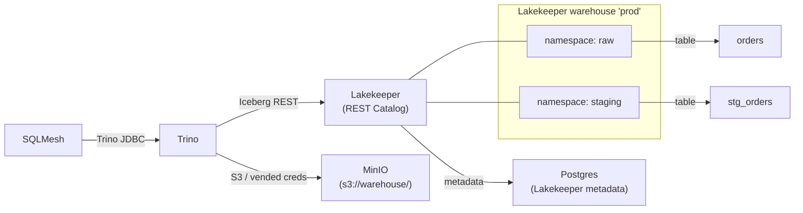

# Iceberg Analytics Engineering Template

Apache Iceberg analytics stack for analytics engineer take-home tests. Trino + Iceberg + Lakekeeper + MinIO + SQLMesh, with UV for Python dependency management.

## Tech Stack

| Component | Version | Purpose |
|-----------|---------|---------|
| Trino | 476 | SQL query engine |
| Apache Iceberg | — | Table format |
| Lakekeeper | v0.12.4 | Iceberg REST Catalog |
| MinIO | RELEASE.2026-08-04 (`pgsty/minio` fork) | S3-compatible object storage |
| SQLMesh | latest | Transformations framework + built-in linter |
| UV | — | Python dependency management |
| just | — | CLI command runner |

## Quick Start

### Docker (local development)

```bash
just setup        # install Python deps
just infra-up     # start Trino, Lakekeeper, MinIO, Postgres (Docker)
just plan-auto    # apply SQLMesh plan (creates tables, loads seeds)
just run          # run models
just test         # run tests
```

### Amp orbs

`.agents/setup` installs uv, just, Docker Engine, and the Compose plugin.
`.amp/services.yaml` runs `dockerd` as the supervised `docker-daemon` orb
service, which `.agents/resume` starts. If Docker is not reachable, run
`amp orb services ensure`, then use the same `just` commands as above.

## Verify Full Stack

```bash
just verify
```

Runs: lint → compose config → infra up → health checks → raw load → SQLMesh plan → run → test → smoke → teardown.

## Services

| Service | Port | Purpose |
|---------|------|---------|
| Trino | 8080 | SQL query engine |
| Lakekeeper | 8181 | Iceberg REST Catalog UI/API |
| MinIO S3 | 9000 | S3 API |
| MinIO Console | 9001 | Web console |

## CLI Commands (justfile)

All commands run via `just`. Run `just --list` to see all recipes.

### Infrastructure

| Command | Purpose |
|---------|---------|
| `just setup` | Install Python deps via UV |
| `just infra-up` | Start all services, wait for healthchecks |
| `just down` | Stop services (keep volumes) |
| `just clean` | Stop and wipe volumes + SQLMesh state (destructive) |
| `just status` | Show container status |
| `just logs` | Tail infrastructure logs |
| `just health` | Check Trino + Lakekeeper health endpoints |
| `just compose-check` | Validate docker-compose config |

### Raw Data Loading

| Command | Purpose |
|---------|---------|
| `just load-raw` | Load CSV files from `data/` into `prod.raw.*` tables |
| `just test-load-raw` | Run raw loader unit tests |

### SQLMesh

| Command | Purpose |
|---------|---------|
| `just plan` | Apply SQLMesh plan (interactive) |
| `just plan-auto` | Apply SQLMesh plan (non-interactive, auto-apply) |
| `just run` | Execute missing model intervals |
| `just test` | Run SQLMesh unit tests |
| `just lint` | Lint SQL models |
| `just format` | Format SQL models |
| `just fetch "SQL"` | Query via SQLMesh fetchdf |
| `just ui` | SQLMesh browser UI |
| `just dag` | Render DAG as HTML |

### Trino Direct Access

| Command | Purpose |
|---------|---------|
| `just trino-query "SQL"` | Run SQL via Trino CLI (non-interactive) |
| `just trino-shell` | Open interactive Trino CLI shell |
| `just smoke` | Show schemas + tables via Trino CLI |

### Full Verification

| Command | Purpose |
|---------|---------|
| `just verify` | Full stack: lint → infra → raw load → plan → run → test → smoke → teardown |

## Project Structure

```
models/          SQLMesh models (SQL files)
seeds/           CSV fixture data
data/            Raw CSV files — loaded by `just load-raw` into prod.raw.*
infra/           Docker Compose + Trino/Lakekeeper config
config.yaml      SQLMesh project config
justfile         CLI recipes
```

## Raw Data Loading

Place CSV files in `data/` and run `just load-raw` to load them into `prod.raw.<table_name>`.
All files are validated before any table changes. See `data/README.md` for details.

## Adding Models

1. Create a `.sql` file under `models/`.
2. Define the `MODEL (...)` block with name, kind, and audits.
3. Run `just lint` to check for issues.
4. Run `just plan` to apply.
5. Run `just run` to execute.

## Architecture


```mermaid
graph LR
    sqlmesh["SQLMesh"]
    trino["Trino"]
    lakekeeper["Lakekeeper\n(REST Catalog)"]
    minio["MinIO\n(s3://warehouse/)"]
    postgres["Postgres\n(Lakekeeper metadata)"]

    sqlmesh -- "Trino JDBC" --> trino
    trino -- "Iceberg REST" --> lakekeeper
    lakekeeper -- "metadata" --> postgres
    trino -- "S3 / vended creds" --> minio

    subgraph "Lakekeeper warehouse 'prod'"
        ns_raw["namespace: raw"]
        ns_staging["namespace: staging"]
    end
    lakekeeper --- ns_raw
    lakekeeper --- ns_staging
    ns_raw -- "table" --> tbl_orders["orders"]
    ns_staging -- "table" --> tbl_stg["stg_orders"]
```

### Catalog and namespace hierarchy

The terminology can be confusing because "catalog" is used in two senses:

- **Lakekeeper** is the metadata/catalog **service**. It manages one or more
  **warehouses**. This template creates a warehouse named `prod`.
- A **Trino catalog** is a connector configuration file (`<name>.properties`).
  The file name becomes the first component of `catalog.schema.table` in SQL.
  One Trino instance can have multiple Iceberg connector configurations,
  typically one per Lakekeeper warehouse.

This template uses a Trino catalog named `prod` (from `prod.properties`) that
points to the Lakekeeper warehouse `prod`. The names happen to match but are
different concepts.

**Hierarchy:**

```
Lakekeeper (metadata service)
└── warehouse "prod" (S3 bucket "warehouse")
    ├── namespace "raw"        → Trino schema: prod.raw
    │   └── table "orders"     → Trino table: prod.raw.orders
    └── namespace "staging"    → Trino schema: prod.staging
        └── table "stg_orders" → Trino table: prod.staging.stg_orders
```

**Example:**

```sql
-- prod = Trino catalog (from prod.properties)
-- raw = Iceberg namespace (Trino schema)
-- orders = Iceberg table (Trino table)
SELECT * FROM prod.raw.orders LIMIT 5;
```

- SQLMesh connects to Trino via JDBC and submits all model SQL there.
- Trino's static `prod` catalog points to Lakekeeper warehouse `prod`.
- Lakekeeper stores table metadata in Postgres and vends S3 credentials to Trino.
- Trino reads/writes Parquet data files in MinIO using vended credentials.
- Namespace = Trino schema (e.g. `raw`, `staging`). Table = Iceberg table.

Static catalog `prod` loads at startup (points to warehouse `prod`).
Dynamic catalog management enabled — create additional catalogs at runtime:

```sql
CREATE CATALOG silver USING iceberg
WITH (
    "iceberg.catalog.type" = 'rest',
    "iceberg.rest-catalog.uri" = 'http://lakekeeper:8181/catalog',
    "iceberg.rest-catalog.warehouse" = 'silver',
    "iceberg.rest-catalog.nested-namespace-enabled" = 'true',
    "iceberg.rest-catalog.vended-credentials-enabled" = 'true',
    "fs.native-s3.enabled" = 'true',
    "s3.endpoint" = 'http://minio:9000',
    "s3.region" = 'local-01',
    "s3.path-style-access" = 'true'
)
```

## Local Credentials

No `.env` file is needed. The stack uses fixed, non-secret local development
values set directly in `infra/docker-compose.yml` and
`infra/lakekeeper/create-warehouse.json`:

| Setting | Value | Purpose |
|---------|-------|---------|
| MinIO root user | minio-root-user | MinIO admin user / S3 access key |
| MinIO root password | minio-root-password | MinIO admin password / S3 secret key |
| Lakekeeper PG encryption key | This-is-NOT-Secure! | Lakekeeper DB encryption key |

Do not reuse these values outside local development.
