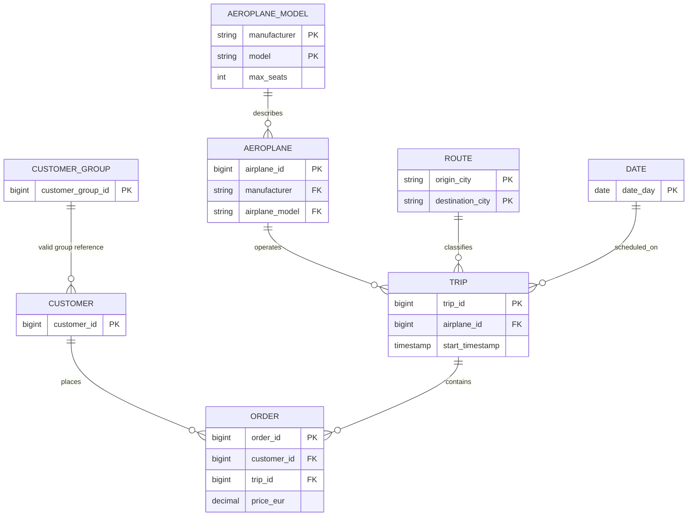

# Air Service analytical model

## Design

Raw source fidelity is separated from business interpretation. `scripts/load_raw.py` recreates all six `prod.raw` Iceberg tables from CSV as text, outside SQLMesh. `external_models.yaml` declares those tables to SQLMesh. Staging views trim, type, normalize, and expose quality states. Intermediate views perform reusable joins. Full Iceberg dimensions, facts, and marts give stable consumption contracts. Trino catalog `prod` and Lakekeeper warehouse `prod` are distinct concepts whose names intentionally match.

`FULL` is deliberate for current-state files with no ingestion, update, or deletion timestamps: an incremental strategy could retain stale records or status values. At production scale, require CDC or immutable event timestamps, then change facts to incremental-by-time or unique-key models and partition by event date.

Customer group relationship is optional and partially unresolved. No rows are dropped: `group_reference_status` distinguishes `individual`, `resolved`, and `unresolved`.

## Model dictionary and grain

| Layer/model | Kind | Grain/key | Purpose |
|---|---|---|---|
| `raw.*` | External Iceberg | Source row | Lossless text landing, managed by non-SQLMesh loader |
| `staging.stg_aeroplane` | View | `airplane_id` | Typed aircraft inventory |
| `staging.stg_aeroplane_model` | View | `manufacturer, model` | Typed model specifications |
| `staging.stg_customer` | View | `customer_id` | Clean customer contacts and group key |
| `staging.stg_customer_group` | View | `customer_group_id` | Clean group reference |
| `staging.stg_order` | View | `order_id` | Typed EUR order and normalized status |
| `staging.stg_trip` | View | `trip_id` | Typed schedule plus chronology classification |
| `intermediate.int_city_geography` | View | `city` | Explicit city/country/region mapping |
| `intermediate.int_customer_enriched` | View | `customer_id` | Group enrichment without dropping unresolved IDs |
| `intermediate.int_trip_enriched` | View | `trip_id` | Route, geography, aircraft, and schedule enrichment |
| `intermediate.int_order_enriched` | View | `order_id` | Customer/trip joins and value semantics |
| `dimensions.dim_aircraft` | Full | `airplane_id` | Aircraft and model attributes |
| `dimensions.dim_customer` | Full | `customer_id` | Current customer segmentation |
| `dimensions.dim_customer_group` | Full | `customer_group_id` | Group attributes and observed members |
| `dimensions.dim_route` | Full | `origin_city, destination_city` | Directional route attributes |
| `dimensions.dim_date` | Full | `date_day` | Complete date spine over observed trip range |
| `facts.fct_order` | Full | `order_id` | One order with status-aware value measures |
| `facts.fct_trip` | Full | `trip_id` | One trip, including zero-order trips and seat counts |
| `marts.business_overview` | Full | Reporting period | Portfolio-comparable headline measures |
| `marts.regional_monthly` | Full | `trip_month, origin_region` | Origin-market activity and value |
| `marts.route_performance` | Full | Directional route | Route/use-case performance |
| `marts.aircraft_performance` | Full | Manufacturer/model | Fleet model economics |
| `marts.customer_segments` | Full | Group resolution/type | Individual/group segment performance |
| `marts.price_tier_performance` | Full | Price tier | Order value-band mix |
| `marts.customer_activity_daily` | Full | Date | DAU and trailing WAU/MAU |
| `marts.customer_activity_weekly` | Full | ISO week start | Calendar-week actives/value |
| `marts.customer_activity_monthly` | Full | Calendar month | Calendar-month actives/value |
| `marts.trip_seat_economics` | Full | `trip_id` | Observed booked seats, capacity, and value per seat |

## KPI semantics

- **Active order/customer:** order status is `booked` or `finished`. Cancelled orders are excluded. Because no order activity timestamp exists, active-user date is the associated trip's scheduled start date, not a login or transaction event.
- **DAU:** distinct active-order customers whose trip starts on the date.
- **WAU:** distinct active-order customers with a trip start in the inclusive trailing 7-day window ending on each date. `customer_activity_weekly` separately reports calendar ISO-week actives.
- **MAU:** `mau_30d` is distinct active-order customers in the inclusive trailing 30-day window; `customer_activity_monthly` reports distinct active customers by calendar month.
- **Finished order value:** sum of listed EUR price for `finished` orders. It is a revenue proxy, not recognized accounting revenue.
- **Booked pipeline value:** sum of listed EUR price for `booked` orders only.
- **Active order value:** finished plus booked listed value. **Gross listed order value** includes cancelled rows and is diagnostic only.
- **Portfolio comparison:** `business_overview` includes trip order coverage, active orders per trip, finished value per trip, and active value per active order alongside absolute counts and values.
- **Observed booked seats:** count of non-cancelled order rows, based on evidence that each row has one seat label. It is not passenger count if one seat can have multiple records outside this sample.
- **Observed seat utilization:** active order rows divided by model `max_seats`. Unobserved seats are not proven available inventory.
- **Price tiers:** analytical value bands, not product classes: under EUR 1,000; EUR 1,000–1,999.99; EUR 2,000 and over.
- **Regional metrics:** attributed to trip origin region. Geography is a maintained broad-region mapping; Moscow is assigned to Europe and Mexico to Latin America.
- **Growth:** monthly regional levels are modeled, but no growth rate is emitted because only one month is available.

## Quality controls

SQLMesh audits enforce non-null and unique grains; manufacturer/model, order/customer, order/trip, and trip/aircraft relationships; positive prices/specifications; status/type/tier domains; different route endpoints; valid chronology classifications; and fact-to-source row/value reconciliation. Unit tests cover unresolved group handling, status-aware value/tier behavior, and preservation of zero-order trips.

Known source issues are classified, not hidden or turned into false failures: seven non-null customer group IDs do not resolve; two local end clocks precede start clocks; contact fields are incomplete. All source order, trip, customer, and aircraft relationships resolve.

## Limitations and unavailable metrics

- True product usage, logins, order-created DAU/WAU/MAU, cohorts, retention, conversion funnel, and booking lead time need event timestamps.
- Accounting revenue, take rate, margin, refunds, taxes, and payment success need transaction/fee facts. Finished order value must not be booked as revenue without validation.
- Route distance, speed, fuel/emissions, and range feasibility need airport coordinates/codes, timezone-aware times, and documented aircraft specification units.
- Trip purpose/use case is unavailable because no purpose, itinerary category, or free-text intent is supplied; route patterns are the closest defensible proxy.
- Flight duration and chronology cannot be reliable without timezone or UTC timestamps.
- True capacity, load factor, passengers, group booking size, and availability need seat inventory, quantities, and complete group membership. `max_seats` is model capacity only.
- Customer geography and regional customer growth are unavailable; origin region measures trip supply/demand proxy.
- One month, 20 trips, and one order per customer cannot support trends, seasonality, repeat rate, LTV, or statistically credible portfolio benchmarking.
- Current files have no snapshot date/history. Dimensions are current-state, not slowly changing.
- City mapping is manual reference data and must move to governed geography/airport data before global expansion.
